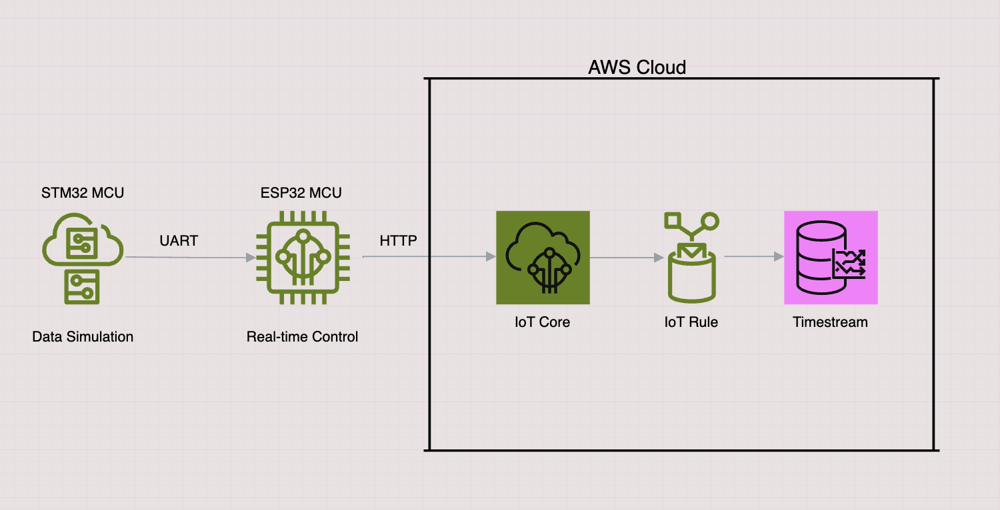

# IoT System with STM32 and ESP32

This project demonstrates the design and development of an IoT system using STM32 and ESP32 MCUs. The system involves sensor simulation on STM32, real-time task scheduling on ESP32 with FreeRTOS, and cloud integration via AWS IoT Core.

## Project Overview

The system integrates STM32 and ESP32 to simulate sensor readings, transmit data, and store it in the cloud for real-time monitoring and analytics. The STM32 uses the Hardware Abstraction Layer (HAL) to simulate sensor data, while the ESP32 handles data processing and cloud communication via WiFi and HTTP protocols.

#### Key Features:
- **[Sensor Simulation on STM32](https://github.com/HajjSalad/STM32-Sensor-Data-Simulation)**: Simulated sensor readings using STM32 HAL, including ADC, PWM, and Timers.
- **Reliable Data Transfer**: Data transmission from STM32 to ESP32 via UART with a handshake mechanism.
- **Real-Time Scheduling on ESP32**: Leveraging FreeRTOS for efficient real-time task scheduling and management.
- **Object-Oriented Design**: Applied OOP principles to design a hierarchical class structure for sensor and device management.
- **Cloud Integration**: Data is transmitted to AWS IoT Core for real-time monitoring, and AWS IoT Rules are used to store data in AWS Timestream for analytics.
  
#### Tools & Software

- **STM32 Development**:
  - STM32CubeIDE (with HAL for configuration)
  - ST-Link Debugger
- **ESP32 Development**:
  - ESP-IDF
  - VS Code (with UART Debugging)
- **Cloud**:
  - AWS IoT Core
  - AWS Timestream
- **Hardware**:
  - STM32 MCU
  - ESP32 MCU

#### System Architecture

- **STM32**: Simulates sensor data and transmits it to the ESP32 over UART.
- **ESP32**: Handles real-time scheduling with FreeRTOS, manages sensors, and communicates with the cloud (AWS IoT Core).
- **Cloud**: AWS IoT Core handles data reception, and AWS IoT Rules send data to AWS Timestream for storage and analysis.

#### OOP Design
##### **`Room` Base class**
- Represents a room in the home.
- Derived classes: `LivingRoom`, `BedRoom`.
##### **`Sensor` Base Class**
- Represents a sensor.
- Derived classes: `TempSensor`, `MotionDetector`.
##### **`Device` Base Class**
- Represents a device.
- Derived classes: `Light`, `AC`, `Heater`.
- 
#### Future Enhancements

- **Data Visualization**: Implement a dashboard to visualize the sensor data stored in AWS Timestream.
- **Machine Learning**: Implement anomaly detection using machine learning models on the ESP32 or in the cloud.

### Diagram

#### Demo

